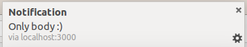
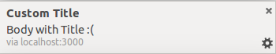
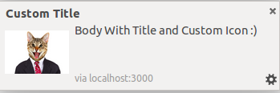

# Push Notifications 

Push Notification library written on top of socket.io

Send push notifications to clients in node.js.

## Installation and Setup
 - npm install push-notifications
 - In your server file
  - `var pushNotifications = require("push-notifications");
  - pushNotifications.push(socket, options);
  - options : 
   - title : Title of the Notification
   - body : Body of the notification
   - icon : Link to the image of the icon
  - Client
   - include notificationLogger.js 
    - 'Either '
    - 'Or '

## Screenshot
 - pushNotifications.push(socket, {body : "Only body :)"});
  - 
 - pushNotifications.push(socket, {title : "Custom Title", body : "Body with Title :("});
  - 
 - pushNotifications.push(socket, {icon : "./cat.png", title : "Custom Title", body : "Body With Title and Custom Icon :)"});
  - 

## Browser Support

Works best on latest versions of Google Chrome, Firefox and Safari.